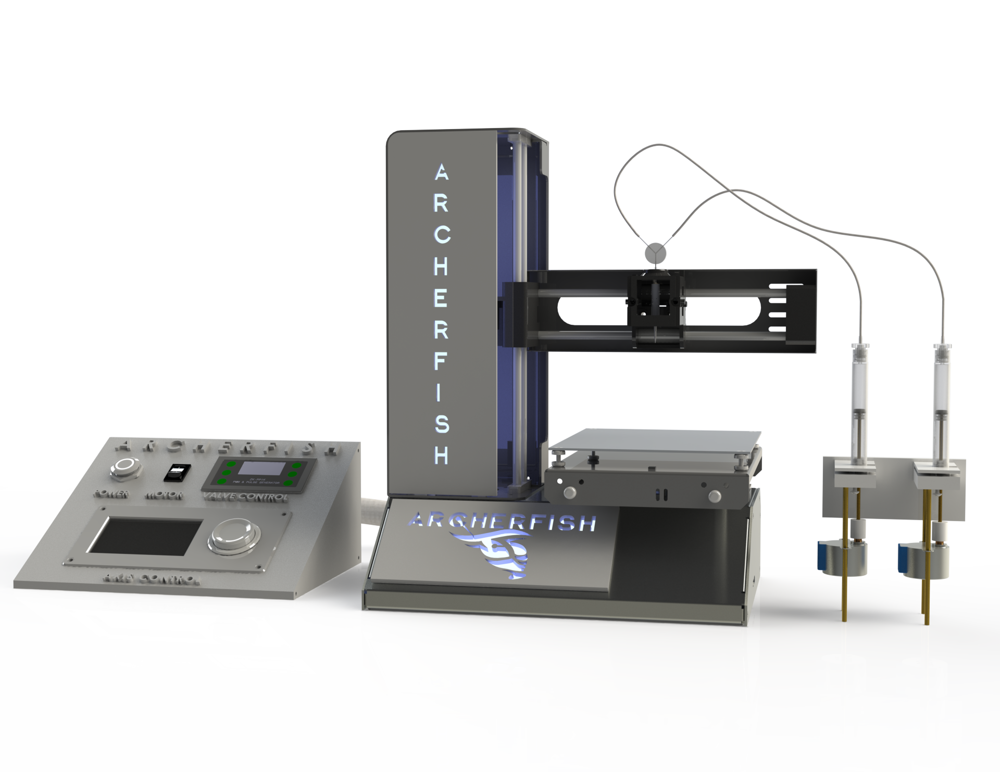

# \#Archerfish

**Project Name:** \#Archerfish

**Project Lead:** Aleks Siemenn \<<asiemenn@mit.edu>\>

**Collaborators:** Jim Serdy, Basita Das, Eunice Aissi, Tonio Buonassisi

**Abstract**: The principle of "build fast, fail faster" has significantly shortened the timeline from ideation to final product in mechanical engineering, paralleling the rise of 3D printing technology and rapid prototyping. In contrast, material science has yet to achieve similar advancements in rapid learning cycles, hindered by the predominantly manual nature of its experimental procedures. For example, to test a material, it is conventionally synthesized at the same fidelity as industry standards, such as using manual spin coating, rather than being treated as a "rapid prototype." Implementing rapid prototyping principles into parts of these experimental procedures can help to shorten the timeline of the materials development pipeline, just as it does for mechanical design. Here, we introduce the design of Archerfish, a low-cost and high-throughput combinatorial mixing and deposition platform to accelerate the screening of material compounds. With this high-throughput combinatorial printing (HTCP) design, we demonstrate combinatorial mixing and printing throughputs of 250 unique compounds per minute. Furthermore, we validate the formation of combinatorial material gradients using hyperspectral image analysis. The proposed low-cost HTCP design expands accessibility to rapid materials screening technology, enabling scientists to make faster experimentally-informed decisions for the development of new materials. 

## Explanation of code within GitHub Repo:
### [1] Archerfish BOM.xlxs
Detailed Bill of Materials for the Archerfish System. 

### [2] 2_Motor_Step_Arduino/2_Motor_Step_Arduino.ino
Simple Arduino Mega gradient printing code for two 28BYJ-48 5V Stepper Motors with ULN2003 Drivers. This code drives both syringes in the archerfish system to create a gradient of droplets. Package version AccelStepper >= 1.64 and Arudino IDE >= 2.2.1 were used to develop this code.

### [3] Raster_R5_MP.gcode
G-code for a Monoprice MP Select Mini 3D Printer to raster the gradient printed by the Archerfish system on a 100mm x 100mm polyester sheet. Marlin-flavor G-code is used to develop this code.

### [4] Archerfish.step
Detailed CAD Model of the Archerfish System. Open-access CAD model of the complete Archerfish assembly can also be found on [GrabCAD](https://grabcad.com/library/archerfish-1)

### [5] Archerfish_UI_Box.png
Rendering of the User Interface Box.

### [6] renderings/Archerfish_Render.png
Rendering of the whole Archerfish System.

### [7] renderings/Junction_nozzle_mixing_R1.png
Rendering of the Junction and Nozzle assembly. 

### [8] renderings/Syringe_pump_construction_R2.png
Rendering of the Syringe Pumps.  

### [9] /data
The folder contains the paper's relevant hyperspectral, EDS, and profilometry data.

